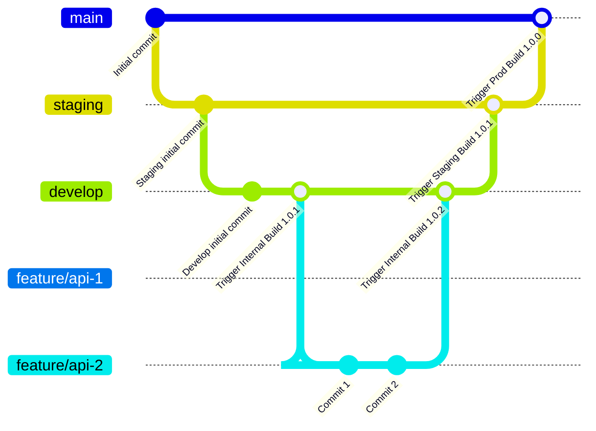

# Template API

Template is an innovative platform designed to revolutionize motorcycle insurance services for One World, specifically targeting Class C/D/E motorcycle owners. The platform is web-based administrative system, creating a seamless insurance management ecosystem.

## Tech Stack

**Client:** React

**Server:** Node, Express

**ORM:** Prisma

**Database:** MongoDB

## Run Locally

Clone the project

```bash
  git clone https://github.com/sureone-insurtech/sureone-api.git
```

Go to the project directory

```bash
  cd sureone-api
```

Install dependencies

```bash
  npm install
```

Spinup the server

```bash
  npm run dev
```

## Running Test

To run tests, run the command

```bash
  npm run test
```

## Running Lint

To run lint, run the command

```bash
  npm run lint
```

## Git Branching



## API Reference
