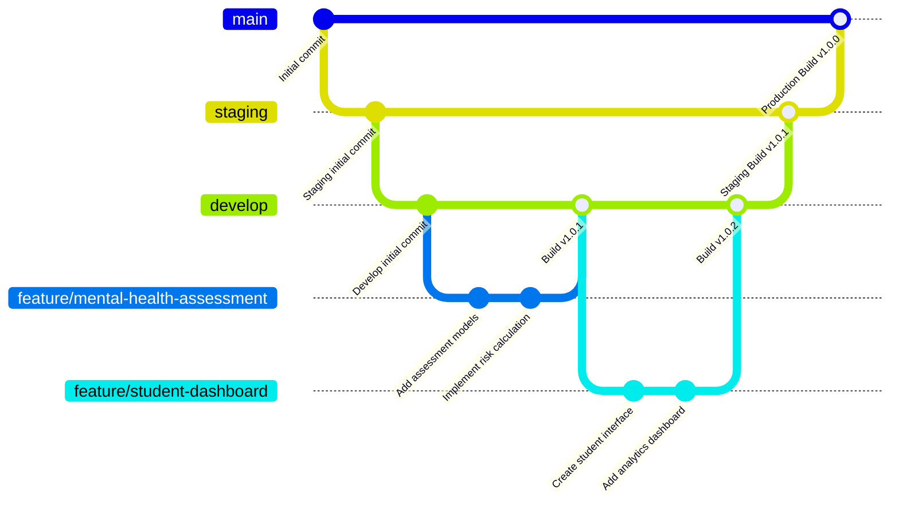

# Mental Health Assessment API

Mental Health Assessment API is an innovative platform designed to support student mental health and wellbeing through data-driven insights and comprehensive assessment tools. The platform provides healthcare professionals, counselors, and educators with real-time mental health risk assessments, enabling early intervention and personalized support for students.

## Features

### 🧠 **Mental Health Assessment**

- **Real-time Risk Assessment**: AI-powered evaluation of student mental health status
- **Multi-dimensional Analysis**: Comprehensive assessment covering anxiety, depression, stress, and suicide risk factors
- **Predictive Analytics**: Machine learning models to predict academic performance and mental health outcomes
- **Risk Level Classification**: Clear categorization (Low, Moderate, High, Critical) with actionable recommendations

### 👥 **Student Management**

- **Student Profiles**: Comprehensive student information management
- **Consent Management**: Secure handling of assessment permissions and privacy controls
- **Assessment History**: Track mental health assessments over time

### 📅 **Appointment & Scheduling**

- **Counseling Appointments**: Schedule and manage mental health consultations
- **Automated Scheduling**: Smart scheduling system for counselors and students
- **Retake Requests**: Handle assessment retake requests and scheduling

### 📊 **Assessment Tools**

- **Anxiety Assessment**: Standardized anxiety level evaluation
- **Depression Screening**: Evidence-based depression assessment tools
- **Stress Evaluation**: Comprehensive stress level analysis
- **Suicide Risk Assessment**: Critical safety evaluation with immediate intervention protocols

### 📨 **Communication & Alerts**

- **Real-time Messaging**: Secure communication between students, counselors, and administrators
- **Critical Alert System**: Immediate notifications for high-risk assessments
- **Announcements**: Platform-wide communication for mental health resources
- **Automated Recommendations**: Personalized mental health guidance and resources

### 📈 **Analytics & Reporting**

- **Mental Health Metrics**: Comprehensive analytics dashboard
- **Risk Trend Analysis**: Track mental health patterns across student populations
- **Performance Insights**: Academic and mental health correlation reports
- **Audit Logging**: Complete activity tracking for compliance and security

### 🔐 **Security & Compliance**

- **RBAC (Role-Based Access Control)**: Secure access management for different user types
- **JWT Authentication**: Secure user authentication and session management
- **HIPAA-Compliant**: Privacy-focused design for sensitive mental health data
- **Audit Trail**: Complete logging of all mental health data access and modifications

## Tech Stack

**Server:** Node.js, Express.js, TypeScript
**ORM:** Prisma
**Database:** MongoDB
**Machine Learning:** ml-random-forest, ml-cart, ml-matrix
**Authentication:** JWT, Argon2, bcrypt
**Real-time Communication:** Socket.IO
**Documentation:** Swagger/OpenAPI
**Testing:** Mocha, Chai
**Code Quality:** ESLint, Prettier, Husky
**Logging:** Winston
**Email:** Nodemailer

## Run Locally

Clone the project

```bash
  git clone https://github.com/git-dariel/capstone-api.git
```

Go to the project directory

```bash
  cd capstone-api
```

Install dependencies

```bash
  npm install
```

Set up environment variables

```bash
  cp .env.example .env
  # Edit .env with your database connection and other configurations
```

Generate Prisma client

```bash
  npm run prisma-generate
```

Run database migrations

```bash
  npm run prisma-migrate
```

Seed the database (optional)

```bash
  npm run prisma-seed
```

Start the development server

```bash
  npm start
```

## Environment Variables

Create a `.env` file in the root directory with the following variables:

```env
# Database
DATABASE_URL="your_mongodb_connection_string"

# JWT Secrets
JWT_SECRET="your_jwt_secret"

# Server Configuration
PORT=5000
NODE_ENV=development
```

## Available Scripts

```bash
# Development
npm start              # Start development server with nodemon
npm run build          # Build the application for production
npm run prod           # Run production build

# Database Operations
npm run prisma-migrate # Run database migrations
npm run prisma-generate # Generate Prisma client
npm run prisma-seed    # Seed database with initial data
npm run prisma-reset   # Reset database
npm run prisma-docs    # Open Prisma Studio

# Code Quality
npm run lint           # Run ESLint
npm run format         # Fix code formatting with ESLint
npm test               # Run test suite

# Data Generation
npm run generate-data  # Generate sample data for testing
```

## Running Tests

To run the test suite:

```bash
npm test
```

## API Documentation

Once the server is running, you can access the API documentation at:

```
http://localhost:5000/api/docs
```

This provides an interactive Swagger interface for testing all endpoints.

## Key API Endpoints

### Authentication

- `POST /api/auth/register` - Register new user
- `POST /api/auth/login` - User login
- `POST /api/auth/refresh` - Refresh access token
- `POST /api/auth/logout` - User logout

### Mental Health Assessments

- `POST /api/consent` - Create consent and generate mental health prediction
- `GET /api/anxiety` - Get anxiety assessment data
- `GET /api/depression` - Get depression assessment data
- `GET /api/stress` - Get stress assessment data
- `GET /api/suicide` - Get suicide risk assessment data

### Student Management

- `GET /api/student` - Get all students
- `GET /api/student/:id` - Get specific student
- `POST /api/student` - Create new student
- `PUT /api/student/:id` - Update student information

### Appointments & Scheduling

- `GET /api/appointment` - Get appointments
- `POST /api/appointment` - Schedule new appointment
- `GET /api/schedule` - Get schedule information
- `POST /api/retake-request` - Request assessment retake

### Communication

- `GET /api/message` - Get messages
- `POST /api/message` - Send message
- `GET /api/announcement` - Get announcements

### Analytics

- `GET /api/metrics` - Get mental health metrics and analytics

## Mental Health Assessment Features

### Risk Assessment Levels

The system provides four levels of mental health risk assessment:

- **🟢 Low Risk**: Student appears to be managing well with minimal risk indicators
- **🟡 Moderate Risk**: Student shows some risk factors that warrant attention
- **🟠 High Risk**: Student displays concerning patterns suggesting potential mental health issues
- **🔴 Critical Risk**: Student shows multiple indicators requiring immediate intervention

### Assessment Factors

The AI-powered assessment considers multiple factors:

- **Sleep Patterns**: Duration and quality of sleep
- **Stress Levels**: Academic and personal stress indicators
- **Behavioral Indicators**: Social engagement and activity patterns
- **Risk Factors**: Combined analysis of multiple mental health indicators

### Real-time Predictions

Each assessment provides:

- **Risk Level Classification** with confidence percentage
- **Academic Performance Outlook** prediction
- **Specific Risk Factors** identified
- **Actionable Recommendations** for intervention
- **Urgency Level** for required response

## Data Privacy & Security

- **HIPAA Compliance**: All mental health data is handled according to healthcare privacy standards
- **Encrypted Storage**: Sensitive data is encrypted at rest and in transit
- **Role-Based Access**: Different access levels for students, counselors, and administrators
- **Audit Logging**: Complete audit trail of all data access and modifications
- **Consent Management**: Explicit consent required for all mental health assessments

## Contributing

1. Fork the repository
2. Create a feature branch (`git checkout -b feature/mental-health-enhancement`)
3. Commit your changes (`git commit -m 'Add new mental health feature'`)
4. Push to the branch (`git push origin feature/mental-health-enhancement`)
5. Open a Pull Request

## Development Workflow



## License

This project is licensed under the MIT Licensee - see the [LICENSE](LICENSE) file for details.

## Support

For support and questions:

- Create an issue in the GitHub repository
- Contact the development team
- Check the documentation in the `/docs` folder

## Acknowledgments

- Mental health assessment algorithms based on established psychological research
- Built with modern web technologies for scalability and security
- Designed with healthcare professionals and student counselors
